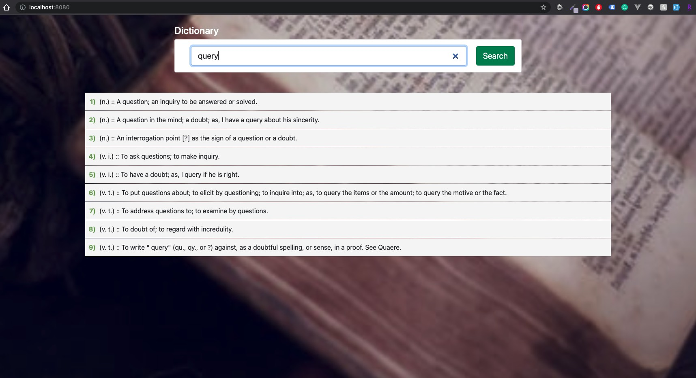

## Online Dictionary

Simple online dictionary using Node.js, Express, MySql and Bootstrap.

Folder structure 

|---- config 
|---- controller 
|---- models 
|---- routes 
|---- public 
|---- server.js

**How to use?**

1. Clone the repository. 
2. Go to the root directory.
3. Unzip the dictionary.sql.zip file and import it to the MySql server. 
4. run the command: npm install (before run the command you need to have NodeJS installed in your computer, if you don't have it, install it first)
5. go to config/db.config.js file and update it with proper credential.
6. run the command: node server.js